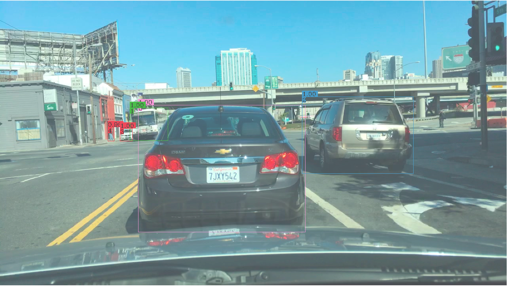

# Lab 2 - Tiling-based Convolution for ResNet-50 Layer with HD Input

## Motivation

Suppose that you are given the following image and asked to draw tight-fitting boxes around various objects in the image. These could be cars, buses, pedestrians, etc. Furthermore, you have to classify each object with a different color. Seems quite trivial, right?


For humans, it may be straightforward to accomplish this task. But for a computer, it requires massive amount of computation power and a well-designed, well-trained deep learning architecture to achieve the same. Not just for training the model, but also for inference.

Here's the final output obtained from a multi-object tracking model called [QDTrack](https://github.com/SysCV/qdtrack), which is the current state-of-the-art in computer vision research for this task.



As may be evident, this "multiple object detection" is useful in many real-world applications, most predominantly in autonomous driving. However, models like QDTrack are huuuuuggge! Not just the model, but the size of inputs (HD and Full-HD) also add immensely to the computation complexity. And with scale comes challenges. In this lab, we will learn to tackle these challenges as we implement a convolution layer of the QDTrack model using HLS. 

Are you ready?

## Convolution for Object Detection

At the core of almost every object detection model is a convolution neural network (CNN) such as VGG-16, ResNet50, Xception, YOLO, MobileNet, etc. These are essentailly feature extraction networks. They "look" at images and extract salient features such as edges, shapes, and so on. 

Introduced in 2015, ResNet-50 is (still) one of the most popular CNN architectures and forms the backbone of many multi-object detection models, including QDTrack. Let's consider the first convolution layer of ResNet-50 which involves a 7 x 7 convolution. After passing the above input image through this layer, we get 64 two-dimensional "feature maps" as shown below. As you can observe, each layer extracts different features from the input image.


We are interested in implementing this convolution layer of ResNet-50 with the above HD input image. Suppose that the input image (feature map) is described by a 3D tensor ```X(ID, IH, IW)```. We use a filter ```W``` with 64 kernels, each of dimensions ```(ID, KH, KW)``` where ```KH``` and ```KW``` are kernel window heights and widths. The resulting output feature map can be described by another 3D tensor ```Y(OD, OH, OW)```. The output feature map dimesions are a function of the stride ```S``` and padding size ```P``` chosen. For the first layer of ResNet-50, the values of these parameters are described in the table below.

| Layer Parameters |  Layer Values |
| ---------------- | ----------------- |
| Kernel Size (KH x KW)  | 7 x 7 |
| Filter Size	(OD) | 64 |
| Input Feature Map (ID, IH, IW) | (3, 736, 1280) |
| Stride (S) | 2 |
| Padding (P) | 3	|	
| Output Feature Map (OD, OH, OW) | (64, 368, 640) |

If these values do not make any sense to you in the first glance, don't worry. You can learn these concepts easily through this well-written [CNN cheatsheet](https://stanford.edu/~shervine/teaching/cs-230/cheatsheet-convolutional-neural-networks). 

This lab will be split into following parts:
- **Part A**: Unoptimized but synthesizable tiled-convolution in HLS (40 points)
- **Part B**: Optimized (and synthesizable) tiled-convolution in HLS (60 points)


## Part A: Tiling-based Unoptimized Convolution (40 points)

To address the challenges that come with scalability (such as large input size), a typical approach for hardware implementation is to split the input image into tiles and run convolution on each tile. The overall latency is then the latency of individual tile times the number of tiles in the image.

In this part of the lab, you have to implement an unoptimized but synthesizable code that performs tiling-based convolution of the first 7 x 7 layer of ResNet-50 with HD input image. You are provided with a host file which reads the input image, layer parameters, as well the reference output feature map and performs a point-to-comparison with the obtained feature map. Mean Squared Error (MSE) is used as the metric for evaluation.

- ```bin/``` contains the reference binary files
- ```sim.cpp``` is the testbench that checks for functional correctness of your tiling-based convolution. 
- ```tiled_conv.cpp``` is the top-level design that you will synthesize after implementing the convolution operation.
- ```utils.cpp``` has utility functions to assist you with loading and storing of data. You can modify these functions as required or add any new ones for your design.
- ```conv_7x7.cpp``` is the convolution engine that performs 7 x 7 convolution for a single tile.


While loading a tile, you would need to load some additional "features" of adjacent tiles. This is defined by ```MARGIN``` in the ```conv.h``` header file which you need to update. DO NOT change any other values in ```conv.h``` (as this file is not required for submission).

**Note**: You are strongly encouraged to use software emulation mode to assist us with debugging before jumping into the hardware/hardware emulation and starting to play around with those pragmas.

**Note**: You DO NOT need to add optimization pragmas in this part of the lab. The goal is to implement a trivial tiling-based convolution layer implementation that is functionally correct and establish a baseline. 

**Hint**: Following a calcluation method similar to the one described in the above article, you will observe that the 7 x 7 layer we are dealing with comprises of **~2.21 billion** MAC operations. At 100 MHz (10ns) clock, this translates to **~22.1** seconds. Note hardware emulation mode uses 300 MHz clock by dafult, so the latency number should by decreased by three times by default. Your unoptimized (trivial) synthesis latency should be close to this value.

**Caution**: Do not use any ```float``` variables while implementing your design. Since there is a type-casting of data type from floating-point to fixed-point for synthesis, you should always use ```fm_t``` or ```wt_t```.


### What to Submit 
1. ```PartA.tar.gz``` that contains the following:
   - ```utils.h```
   - ```utils.cpp```
   - ```conv_7x7.cpp```
   - ```tiled_conv.cpp```
   - ```unoptimized_csynth.rpt``` (Please rename ```csynth.rpt``` to ```unoptimized_csynth.rpt```)
2. A brief report (preferably in PDF format) describing:
   - How many marginal features are needed to implement tiling?
   - What is the MSE obtained in floating-point simulation?
   - What is the MSE obtained in fixed-point simulation?
   - What is the unoptimized latency and resource utilization obtained?
   - What is the communication overhead? (Communication overhead is the ratio of load/store latency and the computation latency) 

## Part B: Tiling-based Optimized Convolution (60 points)

Now for the most fun (and challenging) part of this lab (and course). Take your Part A code and apply all your favorite pragmas and other techniques to optimize your convolution implementation. 

You are provided with an identical copy of the source code files in a separate folder. Once done with Part A, you may copy parts of your code to Part B. Steps to run the code for simulation and synthesis are the same as Part A.

Your target in this part of the lab is to achieve a latency of ```750 ms or lower``` (under 100 MHz, so 250 ms under 300 MHz) without exceeding 100% resource utilization. You are also required to estimate how much of a speedup your optimized 7 x 7 tiling convolution code should hit to meet this overall speedup (Amdahl’s law in action!). 

Furthermore, you need to estimate the communication overhead again and describe how it has changed compared to that of trivial implementation. 

### What to Submit 
1. ```PartB.tar.gz``` that contains the following:
   - ```utils.h```
   - ```utils.cpp```
   - ```conv_7x7.cpp```
   - ```tiled_conv.cpp```
   - ```optimized_csynth.rpt``` (Please rename ```csynth.rpt``` to ```optimized_csynth.rpt```)
2. A brief report (preferably in PDF format) describing:
   - What is the optimized latency and resource utilization obtained?
   - What are the main techniques you adopted?
   - What is the new communication overhead and how does it compare to value obtained in Part B? 

**Note**: Please combine your Part A, B reports in a single file and submit ```Lab2_Report_<Name>.pdf```. There is no template to follow, however, you are expected to write your report like a research paper.

## How to Run the Codes

The way to run the code is the same as Lab1, please refer to `Lab1/README.md`.

## Submission Deadline
Submission: on Canvas for course students, via email (to TA) for Special Problems students.

Due date: **Nov. 19, 11:59 PM, no extension**. 


## Acknowledgements

This lab is adapted from ECE 8893 - Parallel Programming on FPGAs at Georgia Tech.

## Academic Integrity and Honor Code
You are required to follow HKUST(GZ)'s [Honor Code](https://fytgs.hkust-gz.edu.cn/handbooks/handbook-for-research-postgraduate-studies) and submit your original work in this lab. You can discuss this assignment with other classmates but you should code your assignment individually. You are **NOT** allowed to see the code of (or show your code to) other students.

We will be using the Stanford MOSS tool to detect plagiarism. When there is reasonably clear evidence of a violation, a referral to the Office of the Dean of Students will occur, and all hearings and other resulting procedures will be followed to completion.
